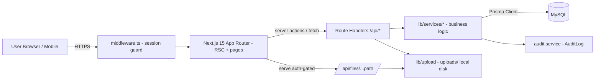

# plan.md — Architecture & Phased Roadmap

> Stack: Next.js 15 App Router (full-stack) + Prisma + MySQL + TypeScript + Tailwind + npm.
> ไฟล์แนบ local disk. Auth email+password (bcryptjs) + JWT cookie (jose) + RBAC 3 ระดับ.

## 1. High-level architecture



## 2. Component responsibilities

| Component | Responsibility |
|---|---|
| `middleware.ts` | ตรวจ JWT cookie ป้องกัน `(dashboard)/*` และ `/api/*` (ยกเว้น auth) |
| App Router (RSC + pages) | UI ไทย, ดึงข้อมูลผ่าน RSC, ฟอร์ม react-hook-form+zod |
| Route Handlers `/api/*` | parse + `withAuth(roles, schema)` → เรียก service → ตอบ envelope |
| `lib/services/*` | business logic ทั้งหมด: codegen, calculatePayout, verification SM, dashboard metrics; ห่อ `$transaction` + `writeAudit` |
| `lib/*` utils | money, date(พ.ศ.), labels, duplicate-check, upload, excel |
| Prisma + MySQL | เก็บข้อมูล; Decimal(12,2) สำหรับเงิน; index ครบ |
| `uploads/` | ไฟล์แนบ local disk; serve auth-gated ไม่ใช่ static public |

## 3. Data model (Prisma schema — ฉบับใช้จริง)

> ไฟล์: `prisma/schema.prisma` — 13 models. เงิน = `Decimal(12,2)` ทุกฟิลด์. enum เก็บอังกฤษ.
> 2 model ที่เพิ่มจาก spec เดิม: **`PayoutItem`** (breakdown + กันจ่ายซ้ำ), **`CodeSequence`** (gen code atomic) — เหตุผลใน decisions.md (ADR-006, ADR-007).

### 3.1 Generator / Datasource

```prisma
generator client {
  provider      = "prisma-client-js"
  binaryTargets = ["native", "windows", "debian-openssl-3.0.x"]
}

datasource db {
  provider = "mysql"
  url      = env("DATABASE_URL")   // dev: mysql://root:@localhost:3306/armay
}
```

### 3.2 Enums

```prisma
enum UserRole            { ADMIN STAFF VIEWER }
enum UserStatus          { ACTIVE INACTIVE }
enum GenericStatus       { ACTIVE INACTIVE }          // owners, properties, tenants, payment_accounts
enum RoomStatus          { AVAILABLE OCCUPIED RESERVED MAINTENANCE INACTIVE }
enum PropertyType        { CONDO APARTMENT HOUSE TOWNHOUSE COMMERCIAL DORMITORY OTHER }
enum RentalType          { DAILY MONTHLY YEARLY }
enum RentalStatus        { BOOKED CHECKED_IN ENDED CANCELLED }
enum PaymentStatus       { UNPAID PARTIAL PAID OVERDUE }
enum VerificationStatus  { DRAFT PENDING VERIFIED NEEDS_FIX CANCELLED PROBLEM }
enum PayoutStatus        { PENDING PARTIAL PAID CANCELLED }
enum ResponsibilityType  { BROKER OWNER TENANT }
enum IncomeType          { RENT DEPOSIT CLEANING WATER ELECTRICITY PENALTY OTHER }
enum ExpenseType         { CLEANING REPAIR MATERIAL WATER ELECTRICITY INTERNET COMMON_AREA TRAVEL ADMIN ADVERTISING OTHER }
enum PaymentMethod       { CASH BANK_TRANSFER PROMPTPAY CREDIT_CARD OTHER }
enum AccountType         { RECEIVE_TENANT PAY_OWNER PERSONAL CASH }
enum AuditAction         { CREATE UPDATE DELETE APPROVE REJECT CANCEL ADJUST LOGIN }
```

### 3.3 Models

```prisma
model User {
  id           Int        @id @default(autoincrement())
  email        String     @unique
  passwordHash String     @map("password_hash")
  fullName     String     @map("full_name")
  role         UserRole   @default(STAFF)
  status       UserStatus @default(ACTIVE)
  createdAt    DateTime   @default(now()) @map("created_at")
  updatedAt    DateTime   @updatedAt @map("updated_at")

  auditLogs        AuditLog[]
  recordedIncomes  IncomeTransaction[]  @relation("IncomeRecordedBy")
  approvedIncomes  IncomeTransaction[]  @relation("IncomeApprovedBy")
  recordedExpenses ExpenseTransaction[] @relation("ExpenseRecordedBy")
  approvedExpenses ExpenseTransaction[] @relation("ExpenseApprovedBy")

  @@index([role])
  @@map("users")
}

model Owner {
  id                Int           @id @default(autoincrement())
  ownerCode         String        @unique @map("owner_code")
  fullName          String        @map("full_name")
  phone             String?
  email             String?
  lineId            String?       @map("line_id")
  address           String?       @db.Text
  bankName          String?       @map("bank_name")
  bankAccountNumber String?       @map("bank_account_number")
  bankAccountName   String?       @map("bank_account_name")
  promptpayId       String?       @map("promptpay_id")
  status            GenericStatus @default(ACTIVE)
  createdAt         DateTime      @default(now()) @map("created_at")
  updatedAt         DateTime      @updatedAt @map("updated_at")

  rooms     Room[]
  contracts RentalContract[]
  incomes   IncomeTransaction[]
  expenses  ExpenseTransaction[]
  payouts   OwnerPayout[]

  @@index([status])
  @@index([fullName])
  @@map("owners")
}

model Property {
  id           Int           @id @default(autoincrement())
  propertyCode String        @unique @map("property_code")
  propertyName String        @map("property_name")
  propertyType PropertyType  @default(CONDO) @map("property_type")
  address      String?       @db.Text
  province     String?
  district     String?
  subdistrict  String?
  latitude     Decimal?      @db.Decimal(10, 7)
  longitude    Decimal?      @db.Decimal(10, 7)
  contactName  String?       @map("contact_name")
  contactPhone String?       @map("contact_phone")
  status       GenericStatus @default(ACTIVE)
  createdAt    DateTime      @default(now()) @map("created_at")
  updatedAt    DateTime      @updatedAt @map("updated_at")

  rooms     Room[]
  contracts RentalContract[]
  incomes   IncomeTransaction[]
  expenses  ExpenseTransaction[]
  payouts   OwnerPayout[]

  @@index([status])
  @@index([province])
  @@map("properties")
}

model Room {
  id                 Int        @id @default(autoincrement())
  roomCode           String     @unique @map("room_code")
  propertyId         Int        @map("property_id")
  ownerId            Int        @map("owner_id")
  roomNumber         String     @map("room_number")
  floor              String?
  roomSize           Decimal?   @db.Decimal(8, 2) @map("room_size")
  roomType           String?    @map("room_type")
  defaultRentPrice   Decimal    @default(0) @db.Decimal(12, 2) @map("default_rent_price")
  defaultDeposit     Decimal    @default(0) @db.Decimal(12, 2) @map("default_deposit")
  defaultCleaningFee Decimal    @default(0) @db.Decimal(12, 2) @map("default_cleaning_fee")
  defaultCommission  Decimal    @default(0) @db.Decimal(12, 2) @map("default_commission")
  status             RoomStatus @default(AVAILABLE)
  note               String?    @db.Text
  createdAt          DateTime   @default(now()) @map("created_at")
  updatedAt          DateTime   @updatedAt @map("updated_at")

  property  Property @relation(fields: [propertyId], references: [id])
  owner     Owner    @relation(fields: [ownerId], references: [id])
  contracts RentalContract[]
  incomes   IncomeTransaction[]
  expenses  ExpenseTransaction[]
  payouts   OwnerPayout[]

  @@index([propertyId])
  @@index([ownerId])
  @@index([status])
  @@map("rooms")
}

model Tenant {
  id               Int           @id @default(autoincrement())
  tenantCode       String        @unique @map("tenant_code")
  fullName         String        @map("full_name")
  phone            String?
  email            String?
  lineId           String?       @map("line_id")
  idCardOrPassport String?       @map("id_card_or_passport")
  nationality      String?
  address          String?       @db.Text
  status           GenericStatus @default(ACTIVE)
  note             String?       @db.Text
  createdAt        DateTime      @default(now()) @map("created_at")
  updatedAt        DateTime      @updatedAt @map("updated_at")

  contracts RentalContract[]
  incomes   IncomeTransaction[]

  @@index([status])
  @@index([fullName])
  @@map("tenants")
}

model RentalContract {
  id             Int           @id @default(autoincrement())
  contractCode   String        @unique @map("contract_code")
  tenantId       Int           @map("tenant_id")
  roomId         Int           @map("room_id")
  ownerId        Int           @map("owner_id")
  propertyId     Int           @map("property_id")
  rentalType     RentalType    @default(MONTHLY) @map("rental_type")
  startDate      DateTime      @map("start_date")
  endDate        DateTime      @map("end_date")
  rentAmount     Decimal       @default(0) @db.Decimal(12, 2) @map("rent_amount")
  depositAmount  Decimal       @default(0) @db.Decimal(12, 2) @map("deposit_amount")
  cleaningFee    Decimal       @default(0) @db.Decimal(12, 2) @map("cleaning_fee")
  otherFee       Decimal       @default(0) @db.Decimal(12, 2) @map("other_fee")
  discountAmount Decimal       @default(0) @db.Decimal(12, 2) @map("discount_amount")
  totalAmount    Decimal       @default(0) @db.Decimal(12, 2) @map("total_amount")
  bookingChannel String?       @map("booking_channel")
  rentalStatus   RentalStatus  @default(BOOKED) @map("rental_status")
  paymentStatus  PaymentStatus @default(UNPAID) @map("payment_status")
  note           String?       @db.Text
  createdAt      DateTime      @default(now()) @map("created_at")
  updatedAt      DateTime      @updatedAt @map("updated_at")

  tenant   Tenant   @relation(fields: [tenantId], references: [id])
  room     Room     @relation(fields: [roomId], references: [id])
  owner    Owner    @relation(fields: [ownerId], references: [id])
  property Property @relation(fields: [propertyId], references: [id])
  incomes  IncomeTransaction[]
  expenses ExpenseTransaction[]
  payouts  OwnerPayout[]

  @@index([tenantId])
  @@index([roomId])
  @@index([ownerId])
  @@index([propertyId])
  @@index([rentalStatus])
  @@index([paymentStatus])
  @@index([startDate])
  @@index([endDate])
  @@map("rental_contracts")
}

model IncomeTransaction {
  id                   Int                @id @default(autoincrement())
  incomeCode           String             @unique @map("income_code")
  contractId           Int                @map("contract_id")
  tenantId             Int?               @map("tenant_id")
  roomId               Int?               @map("room_id")
  ownerId              Int?               @map("owner_id")
  propertyId           Int?               @map("property_id")
  incomeDate           DateTime           @map("income_date")
  incomeType           IncomeType         @map("income_type")
  amount               Decimal            @db.Decimal(12, 2)
  paymentMethod        PaymentMethod      @map("payment_method")
  receivingAccountId   Int?               @map("receiving_account_id")
  transactionReference String?            @map("transaction_reference")
  proofFileUrl         String?            @map("proof_file_url")
  verificationStatus   VerificationStatus @default(DRAFT) @map("verification_status")
  recordedBy           Int?               @map("recorded_by")
  approvedBy           Int?               @map("approved_by")
  approvedAt           DateTime?          @map("approved_at")
  note                 String?            @db.Text
  createdAt            DateTime           @default(now()) @map("created_at")
  updatedAt            DateTime           @updatedAt @map("updated_at")

  contract         RentalContract  @relation(fields: [contractId], references: [id])
  tenant           Tenant?         @relation(fields: [tenantId], references: [id])
  room             Room?           @relation(fields: [roomId], references: [id])
  owner            Owner?          @relation(fields: [ownerId], references: [id])
  property         Property?       @relation(fields: [propertyId], references: [id])
  receivingAccount PaymentAccount? @relation(fields: [receivingAccountId], references: [id])
  recordedByUser   User?           @relation("IncomeRecordedBy", fields: [recordedBy], references: [id])
  approvedByUser   User?           @relation("IncomeApprovedBy", fields: [approvedBy], references: [id])

  @@index([contractId])
  @@index([roomId])
  @@index([ownerId])
  @@index([propertyId])
  @@index([incomeDate])
  @@index([verificationStatus])
  @@index([incomeType])
  @@index([incomeDate, amount, paymentMethod, transactionReference])  // ช่วย duplicate-check
  @@map("income_transactions")
}

model ExpenseTransaction {
  id                 Int                @id @default(autoincrement())
  expenseCode        String             @unique @map("expense_code")
  expenseDate        DateTime           @map("expense_date")
  roomId             Int                @map("room_id")
  ownerId            Int?               @map("owner_id")
  propertyId         Int?               @map("property_id")
  contractId         Int?               @map("contract_id")
  expenseType        ExpenseType        @map("expense_type")
  description        String?            @db.Text
  payeeName          String?            @map("payee_name")
  payeePhone         String?            @map("payee_phone")
  amount             Decimal            @db.Decimal(12, 2)
  paymentMethod      PaymentMethod      @map("payment_method")
  paymentAccountId   Int?               @map("payment_account_id")
  responsibilityType ResponsibilityType @default(BROKER) @map("responsibility_type")
  proofFileUrl       String?            @map("proof_file_url")
  beforeImageUrl     String?            @map("before_image_url")
  afterImageUrl      String?            @map("after_image_url")
  verificationStatus VerificationStatus @default(DRAFT) @map("verification_status")
  recordedBy         Int?               @map("recorded_by")
  approvedBy         Int?               @map("approved_by")
  approvedAt         DateTime?          @map("approved_at")
  note               String?            @db.Text
  createdAt          DateTime           @default(now()) @map("created_at")
  updatedAt          DateTime           @updatedAt @map("updated_at")

  room           Room            @relation(fields: [roomId], references: [id])
  owner          Owner?          @relation(fields: [ownerId], references: [id])
  property       Property?       @relation(fields: [propertyId], references: [id])
  contract       RentalContract? @relation(fields: [contractId], references: [id])
  paymentAccount PaymentAccount? @relation(fields: [paymentAccountId], references: [id])
  recordedByUser User?           @relation("ExpenseRecordedBy", fields: [recordedBy], references: [id])
  approvedByUser User?           @relation("ExpenseApprovedBy", fields: [approvedBy], references: [id])

  @@index([roomId])
  @@index([ownerId])
  @@index([propertyId])
  @@index([contractId])
  @@index([expenseDate])
  @@index([verificationStatus])
  @@index([responsibilityType])
  @@index([expenseType])
  @@map("expense_transactions")
}

model OwnerPayout {
  id                   Int                @id @default(autoincrement())
  payoutCode           String             @unique @map("payout_code")
  ownerId              Int                @map("owner_id")
  roomId               Int?               @map("room_id")
  propertyId           Int?               @map("property_id")
  contractId           Int?               @map("contract_id")
  payoutDate           DateTime           @map("payout_date")
  grossIncomeAmount    Decimal            @default(0) @db.Decimal(12, 2) @map("gross_income_amount")
  deductionAmount      Decimal            @default(0) @db.Decimal(12, 2) @map("deduction_amount")
  netPayoutAmount      Decimal            @default(0) @db.Decimal(12, 2) @map("net_payout_amount")
  paidAmount           Decimal            @default(0) @db.Decimal(12, 2) @map("paid_amount")
  paymentMethod        PaymentMethod?     @map("payment_method")
  ownerBankAccount     String?            @map("owner_bank_account")
  transactionReference String?            @map("transaction_reference")
  proofFileUrl         String?            @map("proof_file_url")
  payoutStatus         PayoutStatus       @default(PENDING) @map("payout_status")
  verificationStatus   VerificationStatus @default(DRAFT) @map("verification_status")
  note                 String?            @db.Text
  createdAt            DateTime           @default(now()) @map("created_at")
  updatedAt            DateTime           @updatedAt @map("updated_at")

  owner    Owner           @relation(fields: [ownerId], references: [id])
  room     Room?           @relation(fields: [roomId], references: [id])
  property Property?       @relation(fields: [propertyId], references: [id])
  contract RentalContract? @relation(fields: [contractId], references: [id])
  items    PayoutItem[]

  @@index([ownerId])
  @@index([roomId])
  @@index([contractId])
  @@index([payoutDate])
  @@index([payoutStatus])
  @@index([verificationStatus])
  @@map("owner_payouts")
}

// breakdown ต่อ payout: "แสดงที่มาการหักทุกครั้ง" + กันธุรกรรมเดิมถูกจ่ายซ้ำ
model PayoutItem {
  id         Int      @id @default(autoincrement())
  payoutId   Int      @map("payout_id")
  sourceType String   @map("source_type")  // "INCOME" | "EXPENSE" | "COMMISSION"
  sourceId   Int?     @map("source_id")     // income/expense id (null สำหรับ COMMISSION)
  label      String
  amount     Decimal  @db.Decimal(12, 2)    // + = gross, - = deduction
  createdAt  DateTime @default(now()) @map("created_at")

  payout OwnerPayout @relation(fields: [payoutId], references: [id], onDelete: Cascade)

  @@index([payoutId])
  @@unique([sourceType, sourceId])          // ธุรกรรมหนึ่งเข้า payout ได้ครั้งเดียว
  @@map("payout_items")
}

model PaymentAccount {
  id                Int           @id @default(autoincrement())
  accountName       String        @map("account_name")
  bankName          String?       @map("bank_name")
  accountNumber     String?       @map("account_number")
  accountHolderName String?       @map("account_holder_name")
  promptpayId       String?       @map("promptpay_id")
  accountType       AccountType   @map("account_type")
  qrCodeUrl         String?       @map("qr_code_url")
  status            GenericStatus @default(ACTIVE)
  createdAt         DateTime      @default(now()) @map("created_at")
  updatedAt         DateTime      @updatedAt @map("updated_at")

  incomes  IncomeTransaction[]
  expenses ExpenseTransaction[]

  @@index([accountType])
  @@index([status])
  @@map("payment_accounts")
}

model AuditLog {
  id        Int         @id @default(autoincrement())
  userId    Int?        @map("user_id")
  action    AuditAction
  tableName String      @map("table_name")
  recordId  Int?        @map("record_id")
  oldValue  Json?       @map("old_value")
  newValue  Json?       @map("new_value")
  ipAddress String?     @map("ip_address")
  createdAt DateTime    @default(now()) @map("created_at")

  user User? @relation(fields: [userId], references: [id])

  @@index([userId])
  @@index([tableName, recordId])
  @@index([createdAt])
  @@map("audit_logs")
}

// เลขรันสำหรับ generate *_code แบบ atomic (กัน race — ห้ามใช้ count()+1)
model CodeSequence {
  id     Int    @id @default(autoincrement())
  entity String            // "OWNER" | "ROOM" | "INCOME" ...
  period String            // "2569-07" หรือ "" ถ้าไม่ผูกเดือน
  lastNo Int    @default(0) @map("last_no")

  @@unique([entity, period])
  @@map("code_sequences")
}
```

## 4. API contract (initial)

Envelope: `{ ok: boolean, data?, error?: { code, message } }`. Auth ทุก endpoint (ยกเว้น login). RBAC: **A**=Admin, **S**=Staff, **V**=Viewer.

| Method | Path | Purpose | Roles |
|---|---|---|---|
| POST | `/api/auth/login` | login → set cookie | public |
| POST | `/api/auth/logout` | ล้าง session | A/S/V |
| GET | `/api/auth/me` | current user | A/S/V |
| GET / POST | `/api/owners` | list+filter / create | GET A/S/V, POST A/S |
| GET/PATCH/DELETE | `/api/owners/[id]` | read / update / soft-delete | DELETE A |
| — | `/api/properties`,`/api/rooms`,`/api/tenants`,`/api/payment-accounts` | เหมือน owners | เหมือนกัน |
| GET / POST | `/api/contracts` | list / create (auto-fill+total) | POST A/S |
| GET/PATCH/DELETE | `/api/contracts/[id]` | — | DELETE A |
| GET / POST | `/api/incomes` | list / create (dup-check) | POST A/S |
| GET/PATCH/DELETE | `/api/incomes/[id]` | แก้ได้เฉพาะยังไม่ VERIFIED | DELETE A |
| POST | `/api/incomes/[id]/approve` | → VERIFIED | **A** |
| POST | `/api/incomes/[id]/adjust` | สร้าง adjustment ของ VERIFIED | A/S |
| — | `/api/expenses` + `[id]` + `/approve` + `/adjust` | เหมือน incomes | เหมือนกัน |
| POST | `/api/payouts/calculate` | คำนวณ breakdown (ยังไม่ commit) | A/S |
| GET / POST | `/api/payouts` | list / create (กันซ้ำ) | POST A/S |
| GET/PATCH | `/api/payouts/[id]` | — | PATCH A/S |
| POST | `/api/payouts/[id]/approve` | ยืนยันจ่าย → VERIFIED/PAID | **A** |
| POST | `/api/uploads` | upload สลิป/รูป → คืน url | A/S |
| GET | `/api/files/[...path]` | serve ไฟล์ (auth-gated) | A/S/V |
| GET | `/api/dashboard/metrics` | KPI + notifications | A/S/V |
| GET | `/api/reports` | รายงาน + filter | A/S/V |
| GET | `/api/export/[entity]` | xlsx ตาม filter | A/S/V |
| GET / POST | `/api/users` + `[id]` | จัดการผู้ใช้ | **A** |
| GET | `/api/audit-logs` | list + filter | A |

Query params มาตรฐาน (list): `?month=2569-07&propertyId=&ownerId=&tenantId=&roomId=&status=&page=1&pageSize=20&q=`

## 5. Phased roadmap

| Phase | ชื่อ | Depends | Done criteria |
|---|---|---|---|
| **P0** Setup | — | `npm run dev` ขึ้น, `prisma migrate` สำเร็จ, schema+enums ครบ, singleton, tailwind, seed admin |
| **P1** Auth & RBAC | P0 | login/logout/me, JWT cookie, middleware กัน dashboard, `requireRole()`, 3 role ผ่าน |
| **P2** Shared Kernel | P0 | codegen/money/date(พ.ศ.)/labels/duplicate/audit/api-handler + DataTable/FilterBar/form components (มี unit test date+money+codegen) |
| **P3** Master Data | P1,P2 | owners/properties/rooms/tenants/payment-accounts CRUD ครบ (API+UI+validation+audit+filter) |
| **P4** Contracts | P3 | สร้าง/แก้/list contract, auto-fill+คำนวณ total, สถานะ |
| **P5** Transactions | P3,P4 | รายรับ(ผูก contract, dup-check)/รายจ่าย(ผูก room), แนบไฟล์, verification SM, approve, adjust |
| **P6** Owner Payouts | P5 | `calculate` breakdown (PayoutItem), กันจ่ายซ้ำ, approve, สถานะ payout |
| **P7** Dashboard/Reports/Export | P5,P6 | metrics (ไม่รวม CANCELLED, กำไรสุทธิ), รายงาน+filter, export xlsx, 6 notifications |
| **P8** Audit/Settings/Polish | P1–P7 | audit-log UI, users mgmt, maintenance view, settings, empty/loading/error states |

Dependency: `P0 → P1,P2`; `P1+P2 → P3 → P4 → P5 → P6`; `P5+P6 → P7`; ทั้งหมด `→ P8`.

## 6. Risk register

| ID | Risk | L | I | Mitigation |
|---|---|---|---|---|
| R-01 | Decimal↔number ทำเงินผิด / serialize `Prisma.Decimal` พัง | M | H | บังคับผ่าน `lib/money.ts`; serialize เป็น string ที่ API; รวมยอดด้วย Decimal |
| R-02 | วันที่ พ.ศ.↔UTC เพี้ยน/off-by-one | M | H | เก็บ UTC; แปลง +543 ที่ UI ผ่าน `lib/date.ts`; คำนวณช่วงเดือนแบบ Asia/Bangkok |
| R-03 | Race ตอน gen `*_code` | M | M | `CodeSequence` + `$transaction` atomic (ห้าม count()+1) |
| R-04 | แก้/ลบ VERIFIED หลุด guard | M | H | guard ที่ `verification.service.ts` (server); UI ซ่อนปุ่ม; ต้อง adjust |
| R-05 | จ่ายเจ้าของซ้ำ | M | H | `PayoutItem @@unique([sourceType, sourceId])` + คำนวณใน transaction |
| R-06 | บันทึกรายรับซ้ำ | M | M | `checkDuplicateIncome()` ก่อน insert; override เฉพาะ Admin |
| R-07 | Local upload: path traversal/ไฟล์อันตราย | M | H | validate mime+ext+size, ตั้งชื่อ uuid, serve auth-gated |
| R-08 | RBAC หลุดฝั่ง client | M | H | บังคับที่ server ทุก endpoint ผ่าน `withAuth(roles)` |
| R-09 | N+1 / รายงานช้าเมื่อข้อมูลโต | M | M | index ครบ; `groupBy`; paginate เสมอ |
| R-10 | กำไรสุทธิ/รวม CANCELLED ผิด | L | H | สูตรรวมศูนย์ใน `dashboard.service.ts`; filter `status != CANCELLED`; unit test สูตร |
| R-11 | transaction ข้ามตาราง (payout+items+audit) ไม่ atomic | M | H | ครอบด้วย `prisma.$transaction([...])` |
| R-12 | MySQL enum drift ตอน migrate | L | M | คุม enum ที่ Prisma; migrate ผ่าน CLI; ห้ามแก้ enum ด้วยมือ |

## 7. Rollout & ops (ระดับแนวทาง, นอก v1)

- Environments: dev (laragon MySQL) → prod (Node host + MySQL)
- Backup: mysqldump รายวัน + สำรอง `uploads/`
- ก่อน deploy: `npm run build` + `prisma migrate deploy`
