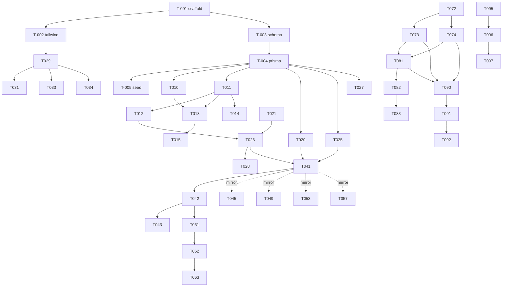

# tasks.md — Atomic Task Backlog

> กติกา: ทุก task = 1 PR (~≤300 LOC), มี ID / depends-on / files-touched / acceptance / test plan.
> Task ที่ขนานกันได้ **ห้ามแตะไฟล์เดียวกัน**; ถ้าเลี่ยงไม่ได้ใส่ `serialize-with`.
> อ่าน [`context.md`](./context.md) + [`plan.md`](./plan.md) ก่อนเริ่มทุก task.

## Legend
- **Status**: `todo` | `in-progress` | `blocked` | `done`
- **Depends-on**: task IDs ที่ต้อง `done` ก่อน
- **Serialize-with**: task IDs ที่รันพร้อมกันไม่ได้ (ไฟล์ทับ)

---

## Phase 0 — Setup & Foundation

### T-001 — Scaffold Next.js 15 + TypeScript
- **Status**: todo · **Depends-on**: — · **Serialize-with**: T-005 (แก้ package.json)
- **Files-touched**: `package.json`, `tsconfig.json`, `next.config.ts`, `.gitignore`, `.eslintrc.json`, `src/app/layout.tsx`, `src/app/page.tsx`
- **Description**: bootstrap Next.js 15 App Router, TS strict, ESLint. `.gitignore` รวม `node_modules`, `.env`, `/uploads/*` (เว้น `.gitkeep`).
- **Acceptance**: [ ] `npm run dev` ขึ้นพอร์ต 3000 · [ ] `npm run build` ผ่าน · [ ] `tsconfig` `strict:true` · [ ] หน้าแรก render ได้
- **Test plan**: manual smoke — `npm run build && npm run start`, เปิด `/`

### T-002 — ติดตั้ง Tailwind CSS
- **Status**: todo · **Depends-on**: T-001
- **Files-touched**: `tailwind.config.ts`, `postcss.config.js`, `src/app/globals.css`
- **Description**: config Tailwind + base styles + ฟอนต์ไทย (เช่น Sarabun/Noto Sans Thai)
- **Acceptance**: [ ] class Tailwind ใช้ได้ · [ ] ฟอนต์ไทยแสดงผลถูก
- **Test plan**: manual — เพิ่ม `
` เห็นสีแดง

### T-003 — Prisma schema + enums + models
- **Status**: todo · **Depends-on**: T-001
- **Files-touched**: `prisma/schema.prisma`, `.env.example`
- **Description**: ใส่ schema ครบตาม [`plan.md §3`](./plan.md) — 13 models, ทุก enums, `Decimal(12,2)`, index, `binaryTargets`. `.env.example` มี `DATABASE_URL`, `JWT_SECRET`, `UPLOAD_DIR`.
- **Acceptance**: [ ] `npx prisma validate` ผ่าน · [ ] `npx prisma migrate dev --name init` สร้างตารางครบ 13 · [ ] ไม่มีฟิลด์เงินเป็น Float
- **Test plan**: รัน migrate กับ DB `armay` บน laragon; ตรวจตารางด้วย `npx prisma studio`

### T-004 — Prisma singleton client
- **Status**: todo · **Depends-on**: T-003
- **Files-touched**: `src/lib/prisma.ts`
- **Description**: export singleton `PrismaClient` กัน connection leak ตอน HMR
- **Acceptance**: [ ] import ใช้ได้ · [ ] dev ไม่เตือน too many connections
- **Test plan**: manual — reload dev หลายครั้ง ไม่มี warning

### T-005 — Seed admin user + demo payment accounts
- **Status**: todo · **Depends-on**: T-004 · **Serialize-with**: T-001 (แก้ `package.json`)
- **Files-touched**: `prisma/seed.ts`, `package.json` (script `seed`)
- **Description**: seed 1 admin (`admin@armay.local`, bcrypt) + payment_accounts ตัวอย่าง 2 บัญชี
- **Acceptance**: [ ] `npm run seed` สร้าง admin ได้ · [ ] password hash ด้วย bcrypt · [ ] rerun แล้วไม่ duplicate (upsert)
- **Test plan**: integration — รัน seed แล้ว query user

---

## Phase 1 — Auth & RBAC

### T-010 — Password hashing util
- **Status**: todo · **Depends-on**: T-004
- **Files-touched**: `src/lib/auth/password.ts`
- **Description**: `hashPassword()` / `verifyPassword()` ด้วย bcryptjs
- **Acceptance**: [ ] hash แล้ว verify ได้ · [ ] verify รหัสผิดคืน false
- **Test plan**: unit (vitest)

### T-011 — JWT session util
- **Status**: todo · **Depends-on**: T-004
- **Files-touched**: `src/lib/auth/session.ts`
- **Description**: sign/verify JWT ด้วย `jose` (edge-compatible), set/clear httpOnly cookie, `getSession()`
- **Acceptance**: [ ] sign→verify คืน payload · [ ] token หมดอายุ verify fail · [ ] cookie httpOnly+secure(prod)
- **Test plan**: unit

### T-012 — RBAC guard
- **Status**: todo · **Depends-on**: T-011 · **Serialize-with**: T-021 (แก้ `src/types/index.ts`)
- **Files-touched**: `src/lib/auth/rbac.ts`, `src/types/index.ts`
- **Description**: `requireRole(roles)`, `can(action, role)` matrix (ADMIN/STAFF/VIEWER)
- **Acceptance**: [ ] STAFF ถูกปฏิเสธ action ADMIN-only · [ ] VIEWER ถูกปฏิเสธทุก write
- **Test plan**: unit — matrix table

### T-013 — Auth API routes
- **Status**: todo · **Depends-on**: T-010, T-011
- **Files-touched**: `src/app/api/auth/login/route.ts`, `src/app/api/auth/logout/route.ts`, `src/app/api/auth/me/route.ts`
- **Description**: login (verify+set cookie), logout (clear), me (คืน user จาก session)
- **Acceptance**: [ ] login ถูก → 200+cookie · [ ] login ผิด → 401 · [ ] me ไม่มี session → 401
- **Test plan**: integration — supertest/route test

### T-014 — Session middleware
- **Status**: todo · **Depends-on**: T-011
- **Files-touched**: `src/middleware.ts`
- **Description**: guard `(dashboard)/*` + `/api/*` (ยกเว้น `/api/auth/*`, `/api/files/*` มี guard เอง) — ไม่มี session → redirect `/login` หรือ 401
- **Acceptance**: [ ] เข้า `/dashboard` โดยไม่ login → redirect login · [ ] API ไม่มี cookie → 401
- **Test plan**: integration

### T-015 — Login page UI
- **Status**: todo · **Depends-on**: T-013
- **Files-touched**: `src/app/(auth)/login/page.tsx`, `src/hooks/useAuth.ts`
- **Description**: ฟอร์ม login ไทย, react-hook-form+zod, toast error, redirect เข้า dashboard
- **Acceptance**: [ ] login สำเร็จ → เข้า dashboard · [ ] ผิด → toast แดง
- **Test plan**: manual + e2e (ทำภายหลัง)

---

## Phase 2 — Shared Kernel (utils + UI)

### T-020 — Code generator
- **Status**: todo · **Depends-on**: T-004
- **Files-touched**: `src/lib/codegen.ts`
- **Description**: `generateCode(entity, {withPeriod?})` → `OWN-0001`, `INC-2569-07-0001` ผ่าน `CodeSequence` ใน `$transaction` (atomic)
- **Acceptance**: [ ] เรียกซ้ำได้เลขไม่ซ้ำ · [ ] concurrent ไม่ชน (test จำลอง) · [ ] period ใช้ พ.ศ.
- **Test plan**: unit + integration (loop insert)

### T-021 — Shared types & API envelope
- **Status**: todo · **Depends-on**: — · **Serialize-with**: T-012 (`src/types/index.ts`)
- **Files-touched**: `src/types/index.ts`
- **Description**: DTO types + `ApiResponse<T>` envelope + `ListQuery` (filter params)
- **Acceptance**: [ ] type ใช้ import ข้ามไฟล์ได้ · [ ] `tsc` ผ่าน
- **Test plan**: typecheck

### T-022 — Money helper
- **Status**: todo · **Depends-on**: — 
- **Files-touched**: `src/lib/money.ts`
- **Description**: `toDecimal()`, `sum(Decimal[])`, `formatTHB()` → `฿1,234.50`, serialize→string
- **Acceptance**: [ ] `sum([0.1,0.2])` = 0.30 เป๊ะ · [ ] format ถูก · [ ] ไม่ใช้ float
- **Test plan**: unit

### T-023 — Thai (พ.ศ.) date util
- **Status**: todo · **Depends-on**: —
- **Files-touched**: `src/lib/date.ts`
- **Description**: `toBE()`, `formatBEDate()` → `6 ก.ค. 2569`, `parseThaiDate()`, `monthRangeUTC('2569-07')` (คืนช่วง UTC ตาม Asia/Bangkok)
- **Acceptance**: [ ] ค.ศ.2026 → พ.ศ.2569 · [ ] `monthRangeUTC` ครอบเดือนถูก (ทดสอบขอบเดือน) · [ ] ไม่ off-by-one
- **Test plan**: unit — เคสขอบเดือน/ปี

### T-024 — Enum label map (ไทย)
- **Status**: todo · **Depends-on**: —
- **Files-touched**: `src/lib/labels.ts`
- **Description**: `label(enumName, value)` → ป้ายไทย ครบทุก enum ใน plan.md §3.2
- **Acceptance**: [ ] ทุก enum value มี label · [ ] ค่าไม่รู้จักคืนค่าเดิม
- **Test plan**: unit — วน enum ครบ

### T-025 — Audit service
- **Status**: todo · **Depends-on**: T-004
- **Files-touched**: `src/lib/services/audit.service.ts`
- **Description**: `writeAudit({userId, action, table, recordId, old, new, ip}, tx?)` เขียน `AuditLog` (รับ tx ได้เพื่ออยู่ใน `$transaction`)
- **Acceptance**: [ ] เขียน old/new เป็น JSON · [ ] ใช้ภายใน `$transaction` ได้
- **Test plan**: integration

### T-026 — API handler wrapper
- **Status**: todo · **Depends-on**: T-012, T-021
- **Files-touched**: `src/lib/api/handler.ts`, `src/lib/api/response.ts`
- **Description**: `withAuth(roles, zodSchema?, fn)` — auth+parse+try/catch→envelope; `ok()/fail()`
- **Acceptance**: [ ] role ไม่พอ → 403 envelope · [ ] zod fail → 400 พร้อม issues · [ ] error → 500 ปลอดภัย (ไม่ leak)
- **Test plan**: unit

### T-027 — Duplicate income check
- **Status**: todo · **Depends-on**: T-004
- **Files-touched**: `src/lib/duplicate.ts`
- **Description**: `checkDuplicateIncome({incomeDate, amount, paymentMethod, transactionReference})` คืน match
- **Acceptance**: [ ] เจอเมื่อ 4 ฟิลด์ตรง · [ ] ไม่เจอเมื่อ ref ต่าง
- **Test plan**: integration

### T-028 — Upload service + file routes
- **Status**: todo · **Depends-on**: T-026
- **Files-touched**: `src/lib/upload.ts`, `src/app/api/uploads/route.ts`, `src/app/api/files/[...path]/route.ts`
- **Description**: `saveFile()` เขียนลง `uploads/` ชื่อ uuid, `validateFile()` (mime/ext/size ≤ 10MB), GET serve auth-gated (กัน path traversal)
- **Acceptance**: [ ] อัปโหลด jpg/png/pdf ได้ · [ ] ไฟล์ exe ถูกปฏิเสธ · [ ] `../` ใน path ถูกบล็อก · [ ] ไม่มี session → 401
- **Test plan**: integration — happy + traversal + wrong-type

### T-029 — UI primitives
- **Status**: todo · **Depends-on**: T-002
- **Files-touched**: `src/components/ui/Button.tsx`, `Input.tsx`, `Select.tsx`, `Modal.tsx`, `Badge.tsx`, `Card.tsx`
- **Description**: primitive components ด้วย Tailwind
- **Acceptance**: [ ] render ทุกตัว · [ ] variant/size props ทำงาน
- **Test plan**: manual + component test

### T-030 — App shell (Sidebar + layout)
- **Status**: todo · **Depends-on**: T-002, T-011 (อ่าน session ใน layout)
- **Files-touched**: `src/components/layout/Sidebar.tsx`, `Topbar.tsx`, `PageHeader.tsx`, `src/app/(dashboard)/layout.tsx`
- **Description**: sidebar 15 เมนู, active state, ซ่อนเมนูตาม role, guard เข้าถึง (อ่าน session)
- **Acceptance**: [ ] 15 เมนูครบ · [ ] VIEWER ไม่เห็นเมนู users/settings · [ ] active highlight
- **Test plan**: manual

### T-031 — DataTable
- **Status**: todo · **Depends-on**: T-029
- **Files-touched**: `src/components/data/DataTable.tsx`
- **Description**: generic table + sort + client paginate + loading/empty states
- **Acceptance**: [ ] sort คอลัมน์ · [ ] paginate · [ ] empty state · [ ] column render custom
- **Test plan**: component test

### T-032 — FilterBar + useFilters
- **Status**: todo · **Depends-on**: T-029, T-023
- **Files-touched**: `src/components/data/FilterBar.tsx`, `src/hooks/useFilters.ts`
- **Description**: filter เดือน(พ.ศ.)/อาคาร/เจ้าของ/ผู้เช่า/ห้อง/สถานะ sync กับ query string
- **Acceptance**: [ ] เปลี่ยน filter → อัปเดต URL · [ ] reload คง filter · [ ] เดือนเป็น พ.ศ.
- **Test plan**: component test

### T-033 — StatusBadge
- **Status**: todo · **Depends-on**: T-029
- **Files-touched**: `src/components/data/StatusBadge.tsx`
- **Description**: สี+ป้ายไทยตาม verification/rental/payment/payout status (ใช้ `labels.ts`)
- **Acceptance**: [ ] ทุก status มีสี · [ ] label ไทยถูก
- **Test plan**: component test

### T-034 — Form controls (Money/Date/File/Field)
- **Status**: todo · **Depends-on**: T-029, T-022, T-023
- **Files-touched**: `src/components/form/FormField.tsx`, `MoneyInput.tsx`, `ThaiDatePicker.tsx`, `FileUpload.tsx`
- **Description**: control reusable — MoneyInput (Decimal-safe), ThaiDatePicker (พ.ศ.), FileUpload (เรียก `/api/uploads`)
- **Acceptance**: [ ] MoneyInput ไม่เพี้ยนทศนิยม · [ ] DatePicker แสดง/รับ พ.ศ. · [ ] FileUpload preview+คืน url
- **Test plan**: component + manual (มือถือถ่ายรูป)

---

## Phase 3 — Master Data

> Pattern ต่อ entity = 4 task: `validation → service → api → ui`. แต่ละ entity แตะไฟล์คนละชุด → **5 entity ขนานกันได้เต็ม**.

### owners (เต็มรูปแบบ — entity อื่น mirror ตามนี้)
- **T-040** `owner validation` · dep: T-021 · files: `src/lib/validation/owner.schema.ts` · zod create/update · unit test
- **T-041** `owner service` · dep: T-020,T-025,T-040 · files: `src/lib/services/owner.service.ts` · CRUD + codegen + audit ใน `$transaction` · [ ] create ได้ code · [ ] soft-delete (status) · integration
- **T-042** `owner api` · dep: T-026,T-041 · files: `src/app/api/owners/route.ts`, `src/app/api/owners/[id]/route.ts` · GET(list+filter+paginate)/POST/PATCH/DELETE ตาม RBAC · integration
- **T-043** `owner UI` · dep: T-031,T-032,T-034,T-042 · files: `src/app/(dashboard)/owners/page.tsx`, `owners/new/page.tsx`, `owners/[id]/page.tsx` · list+form+รายละเอียด(ห้อง+ยอดต้องจ่าย) · manual

### properties (mirror owners)
- **T-044** validation `src/lib/validation/property.schema.ts` · dep: T-021
- **T-045** service `src/lib/services/property.service.ts` · dep: T-020,T-025,T-044
- **T-046** api `src/app/api/properties/route.ts` + `[id]/route.ts` · dep: T-026,T-045
- **T-047** ui `src/app/(dashboard)/properties/{page,new,[id]}` · dep: T-031,T-032,T-034,T-046

### rooms (mirror + บังคับ property+owner)
- **T-048** validation `src/lib/validation/room.schema.ts` (require propertyId+ownerId) · dep: T-021
- **T-049** service `src/lib/services/room.service.ts` (guard property/owner มีจริง) · dep: T-020,T-025,T-048
- **T-050** api `src/app/api/rooms/route.ts` + `[id]/route.ts` · dep: T-026,T-049
- **T-051** ui `src/app/(dashboard)/rooms/{page,new,[id]}` (แสดงประวัติเช่า+รายรับ-รายจ่ายห้อง) · dep: T-031,T-032,T-034,T-050

### tenants (mirror owners)
- **T-052** validation `src/lib/validation/tenant.schema.ts` · dep: T-021
- **T-053** service `src/lib/services/tenant.service.ts` · dep: T-020,T-025,T-052
- **T-054** api `src/app/api/tenants/route.ts` + `[id]/route.ts` · dep: T-026,T-053
- **T-055** ui `src/app/(dashboard)/tenants/{page,new,[id]}` · dep: T-031,T-032,T-034,T-054

### payment-accounts (mirror owners)
- **T-056** validation `src/lib/validation/payment-account.schema.ts` · dep: T-021
- **T-057** service `src/lib/services/payment-account.service.ts` · dep: T-020,T-025,T-056
- **T-058** api `src/app/api/payment-accounts/route.ts` + `[id]/route.ts` · dep: T-026,T-057
- **T-059** ui `src/app/(dashboard)/payment-accounts/{page,new,[id]}` (แนบ QR ผ่าน upload) · dep: T-031,T-032,T-034,T-058

---

## Phase 4 — Contracts

- **T-060** `contract validation` · dep: T-021 · files: `src/lib/validation/contract.schema.ts`
- **T-061** `contract service` · dep: T-020,T-025,T-060 · files: `src/lib/services/contract.service.ts` · auto-fill จาก room defaults, คำนวณ `totalAmount`, derive owner/property จากห้อง, guard status transition · [ ] total ถูก · integration
- **T-062** `contract api` · dep: T-026,T-061 · files: `src/app/api/contracts/route.ts`, `[id]/route.ts`
- **T-063** `contract UI` · dep: T-031,T-032,T-034,T-062 · files: `src/app/(dashboard)/contracts/{page,new,[id]}` · แสดงยอดค้าง+ประวัติจ่าย · manual

---

## Phase 5 — Transactions (income / expense)

- **T-070** `income validation` · dep: T-021 · files: `src/lib/validation/income.schema.ts` (require contractId)
- **T-071** `expense validation` · dep: T-021 · files: `src/lib/validation/expense.schema.ts` (require roomId, responsibilityType)
- **T-072** `verification state machine` · dep: T-025 · files: `src/lib/services/verification.service.ts` · `assertTransition(from,to)`, `assertMutable(status)` (block VERIFIED) · unit test ทุก transition
- **T-073** `income service` · dep: T-070,T-020,T-027,T-072 · files: `src/lib/services/income.service.ts` · create(dup-check)+audit, approve, adjust, อัปเดต `paymentStatus` ของ contract · integration
- **T-074** `expense service` · dep: T-071,T-020,T-072 · files: `src/lib/services/expense.service.ts` · create+audit, approve, adjust · integration
- **T-075** `income api` · dep: T-026,T-073 · files: `src/app/api/incomes/route.ts`, `[id]/route.ts`, `[id]/approve/route.ts`, `[id]/adjust/route.ts` · [ ] approve = ADMIN only · [ ] PATCH VERIFIED → 409
- **T-076** `expense api` · dep: T-026,T-074 · files: `src/app/api/expenses/route.ts`, `[id]/route.ts`, `[id]/approve/route.ts`, `[id]/adjust/route.ts`
- **T-077** `income UI` · dep: T-075,T-028,T-034 · files: `src/app/(dashboard)/incomes/{page,new,[id]}` · แนบสลิป, เตือน dup, แสดงยอดค้าง · manual (มือถือ)
- **T-078** `expense UI` · dep: T-076,T-028,T-034 · files: `src/app/(dashboard)/expenses/{page,new,[id]}` · แนบสลิป+รูปก่อน/หลัง · manual

---

## Phase 6 — Owner Payouts

- **T-080** `payout validation` · dep: T-021 · files: `src/lib/validation/payout.schema.ts`
- **T-081** `payout service` · dep: T-073,T-074,T-025 · files: `src/lib/services/payout.service.ts` · `calculatePayout({ownerId, roomId?, contractId?, period})` สร้าง `PayoutItem` breakdown (gross รายรับ VERIFIED − commission − expense ที่ `responsibilityType=OWNER`), กันจ่ายซ้ำ (unique sourceType+sourceId), commit ใน `$transaction` · [ ] breakdown ครบทุกบรรทัด · [ ] ธุรกรรมซ้ำถูกบล็อก · integration
- **T-082** `payout api` · dep: T-026,T-081 · files: `src/app/api/payouts/route.ts`, `[id]/route.ts`, `calculate/route.ts`, `[id]/approve/route.ts` · [ ] calculate ไม่ commit · [ ] approve = ADMIN only
- **T-083** `payout UI` · dep: T-082,T-034 · files: `src/app/(dashboard)/payouts/{page,new,[id]}` · หน้าคำนวณ→ยืนยัน แสดงที่มาการหัก + แนบสลิปโอน · manual

---

## Phase 7 — Dashboard / Reports / Export

- **T-090** `dashboard service` · dep: T-073,T-074,T-081 · files: `src/lib/services/dashboard.service.ts` · metrics ทั้งหมด (filter `status != CANCELLED`, กำไรสุทธิ = รายรับ − จ่ายเจ้าของ − ค่าใช้จ่าย BROKER) + 6 notifications · [ ] สูตรกำไรถูก · unit test สูตร
- **T-091** `dashboard api` · dep: T-026,T-090 · files: `src/app/api/dashboard/metrics/route.ts`
- **T-092** `dashboard UI` · dep: T-091,T-029 · files: `src/app/(dashboard)/dashboard/page.tsx`, `src/components/charts/*` · KPI cards + กราฟรายรับ-รายจ่ายรายเดือน · manual
- **T-093** `report service+api` · dep: T-073,T-074 · files: `src/lib/services/report.service.ts`, `src/app/api/reports/route.ts` · รายงานตาม §FR-073 + filter
- **T-094** `report UI` · dep: T-093,T-032 · files: `src/app/(dashboard)/reports/page.tsx`
- **T-095** `excel builder` · dep: T-022,T-023 · files: `src/lib/excel.ts` · `buildWorkbook(rows, columns)` ด้วย `exceljs` (เงิน format, วันที่ พ.ศ.) · unit
- **T-096** `export api` · dep: T-095,T-026 · files: `src/app/api/export/[entity]/route.ts` · export xlsx ตาม filter · [ ] ดาวน์โหลดได้ · integration
- **T-097** `ExportButton` · dep: T-096,T-029 · files: `src/components/data/ExportButton.tsx`

---

## Phase 8 — Audit / Settings / Polish

- **T-100** `audit-log api` · dep: T-026,T-025 · files: `src/app/api/audit-logs/route.ts` · list + filter (user/table/action/date)
- **T-101** `audit-log UI` · dep: T-100,T-031,T-032 · files: `src/app/(dashboard)/audit-logs/page.tsx`
- **T-102** `users management` · dep: T-042 (pattern) · files: `src/lib/validation/user.schema.ts`, `src/lib/services/user.service.ts`, `src/app/api/users/route.ts`, `src/app/api/users/[id]/route.ts`, `src/app/(dashboard)/users/{page,new,[id]}` · ADMIN-only CRUD + reset password · integration
- **T-103** `maintenance view` · dep: T-076 · files: `src/app/(dashboard)/maintenance/page.tsx` · มุมมอง expense type `CLEANING`/`REPAIR` (reuse DataTable+FilterBar)
- **T-104** `settings page` · dep: T-030 · files: `src/app/(dashboard)/settings/page.tsx` · เกณฑ์แจ้งเตือน (ห้องว่างกี่วัน/สัญญาใกล้หมดกี่วัน) + ข้อมูลกิจการ

---

## Dependency graph (mermaid)

## Parallelization hints

- **P0**: T-002 และ T-003 ขนานกันได้ (คนละไฟล์) หลัง T-001
- **P1/P2 คาบเกี่ยว**: หลัง T-004 กลุ่ม auth (T-010/T-011) และ util (T-020/T-022/T-023/T-024/T-025/T-027) ขนานกันได้ทั้งหมด
- **P2 UI**: T-029 เสร็จแล้ว T-031/T-033/T-034 ขนานได้
- **P3 Master Data**: 5 entity (owners/properties/rooms/tenants/payment-accounts) **ขนานกันเต็ม** — ไฟล์ไม่ทับกันเลย
- **ระวัง serialize**: `package.json` (T-001↔T-005), `src/types/index.ts` (T-012↔T-021)
- **P5**: T-073 (income) และ T-074 (expense) ขนานได้หลัง T-072
